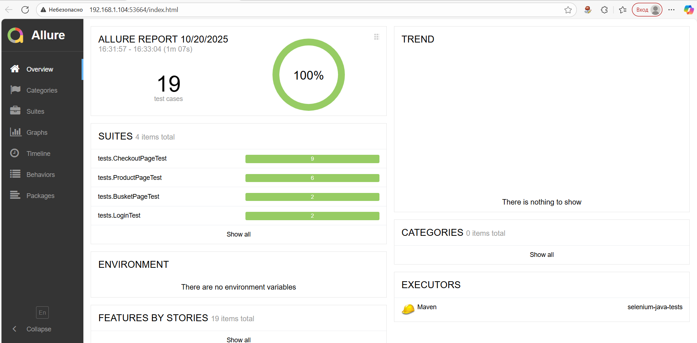

# Selenium Java Tests

Automated UI tests written in **Java** using **Selenium WebDriver**, **JUnit 5**, and optionally **Allure Report**.

## 🧰 Technologies
- Java 17+
- Maven
- Selenium WebDriver
- JUnit 5
- (Optional) Allure Report

## ⚙️ Setup & Run

### 1. Clone the repository
```bash
git clone https://github.com/yourusername/selenium-java-tests.git
cd selenium-java-tests
```

### 2. Install dependencies
```bash 
mvn clean install
```

### 3. Run tests
```bash
mvn test
```
### 4. Generate Allure report (optional)
``` bash
allure serve allure-results
```


📁 Project structure
``` bash
selenium-java-tests/
├── src/
│   ├── main/java/pages/        # Page Object classes
│   └── test/java/tests/        # JUnit test classes
├── pom.xml                     # Maven configuration
└── README.md                   # This file
```

### Example
